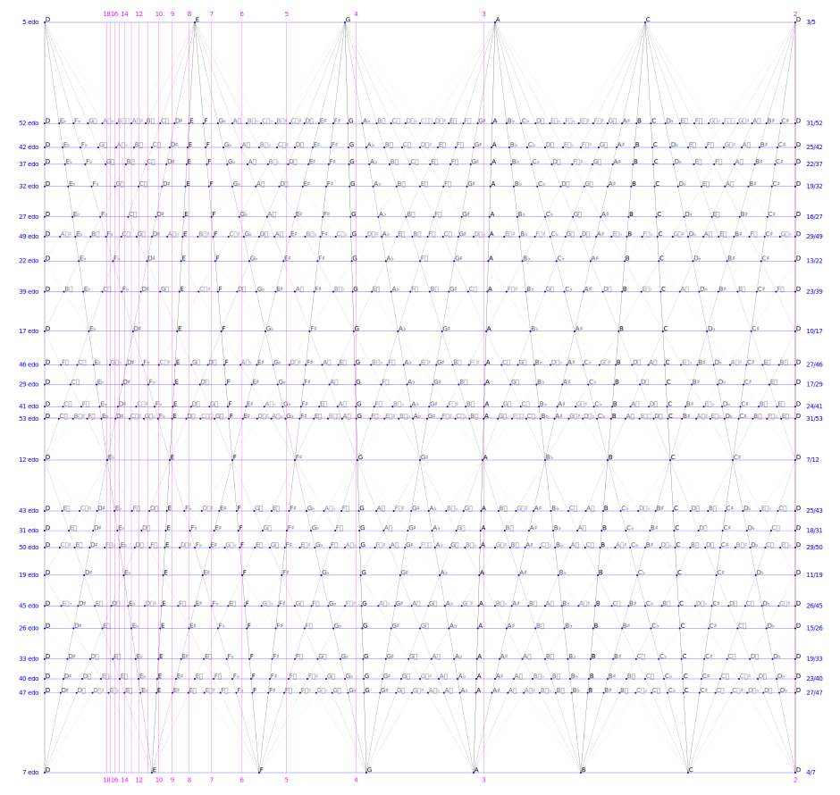

# diatonic-edo

Draws a diagram of diatonic EDO musical scales.



## Requirements

- Python 3.12
- `svgwrite` >= 1.4.3

## Running

```sh
python3 __main__.py
```
generates the `diatonic-edo.svg` file.
